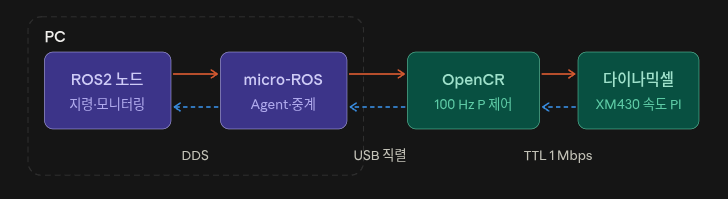

## 문제 1

### 환경 및 설정
- Raspberrypi : Ubuntu Server 22.04.5 LTS, arm64
- 제어기 : OpenCR 보드
- 모터 : XM430-W210(모델명 1030), ID 1(기존 과제의 제공코드는 모델명 XM430-W350, ID 12번 기준이었지만 바퀴 제어를 위해 변경)
- 사용예제 : 'examples/opencr_position_p/opencr_position_p.ino'
- 입력 프롬프트 : s kp speed angle

### 수정 사항
- 모터 ID : 12 -> 1
- 모델명 : XM430-W210 -> 1030

### 증거
- 환경 확인 : [results/환경확인.txt]
- 업로드 로그 : [results/upload.log]
- 실행 A 로그 : [results/실행A.log]

### 값 구분 및 단위
| 항목 | 값 | 단위 |
|---|---|---|
| 목표값 (target_deg) | 90 | ° |
| 측정값 (position_deg, 최종) | 89.824 | ° |
| 제어 출력 (u_deg_s, 정지 직전) | 0.000 | °/s |
| 오차 (error_deg, 최종) | 0.176 | ° |

### 결과 설명
- 목표각 90°에 대해 약 5.2초 후 position_deg가 89.824°까지 도달했고 error_deg가 데드밴드(0.2°) 이내로 줄어들며 정지했다. 종료 시 xSTOP: user 로그가 출력되며 모터의 작동이 정지하는것을 확인했다.

## 문제 2

### 오차와 피드백 해석
| 시점  | 목표각 | 현재각   | 오차   |
| --- | --- | ----- | ---- |
| 초기  | 90  | 87.54 | 2.46 |
| 중간  | 90  | 89.3  | 0.7  |
| 마지막 | 90  | 89.82 | 0.18 |

**오차 표와 설명**

- s 0.5 max 90의 명령어를 입력하여 90도까지 회전하는것을 관찰한 결과 오버슈트는 발생하지 않았지만 2.5도에 가까운 오차가 발생하였다.
3초정도 경과후 오차는 0.7도까지 줄어들었고 2.2초 경과후 오차는 0.18도까지 줄어들었다. 그 이후로 완전히 90도에 도달하지는 않고 오차범위 0.176~0.088도 사이를 왔다갔다하는 것을 관찰할 수 있었다.

- 위치 측정값을 얻는 센서는 실습에 사용하는 dynamixel의 모터에 자체적으로 내장된 엔코더이다. 이 모터는 하드웨어 전용 제어기인 OpenCR과 연결되어 엔코더의 정보를 주고 이 정보는 OpenCR과 연결된 라즈베리파이를 통해 계산하고 출력된다.

- 목표각이 30도이고 현재각이 35도라면 오차는 목표각 - 현재각을 통해서 도출할 수 있으므로 30 - 35 = -5도이다.
Kp의 값이 양수일경우 출력부호는 오차부호와 일치한다. 따라서 보정방향은 -방향이 된다.

## 문제 3

### P 게인 변경에 따른 응답 비교
- 설정 A : s 1 max 90
- 설정 B : s 10 max 90

**응답 비교표**

| 실행 | 목표각 | 속도 | 부하 | 측정주기 | 현재각 | 목표초과여부 |
| --- | --- | --- | --- | --- | --- | --- |
| A | 90 | max | Kp = 1 | 100ms | 87.979 | 목표 미달 |
| B | 90 | max | Kp = 10 | 100ms | 90.176 | 목표 초과 |

A는 게인값이 1이기 때문에 오버슈트가 발생하지 않고 목표각에 비교적 천천히 도달하였다. 하지만 B는 게인값이 10이기 때문에 목표각에 굉장히 빨리 도달하였다.
A는 속도가 느린 대신 오버슈트가 발생하지 않았고, B는 속도가 빨랐지만 오버슈트가 발생하여 90도를 살짝 넘기는 결과가 나왔다.

I : 남아있는 오차를 없앤다.

D : 오차 보완의 움직임속도에 따라 브레이크를 건다.

## 문제 4

### 제어와 통신의 역할 해석

- 구조표를 보면 알 수 있듯이, 목표와 상태를 보내는 주체는 ROS2 노드이다. 목표 각도 토픽을 발행하고, 상태토픽을 구독하여 판단을 하는데 사용한다.
목표와 상태를 받는 주체는 다이나믹셀이다. 스스로 데이터를 보낼 수 없고, OpenCR이 읽기 요청을 할때 자신의 엔코더값을 반환한다.

- 상태발행은 100ms마다 실행되고, 제어 계산은 10ms마다 실행되므로 상태발행 한주기 동안 제어 계산은 100 / 10을 통해 10번 수행된다는것을 알 수 있다.

- 통신 단절시 오래된 명령은 명령마다 수신시각을 토대로 얼마나 오래되었는지를 구분한다. 그 이후 새로운 명령이 일정시간동안 들어오지않으면 자동으로 작동을 종료하도록 한다. 이는 마지막 값을 계속들고있어 오작동 하는것을 막아준다. 단절되었던 통신이 다시 재개된다고 해도 다시 바로 움직일 수 없게 해야한다. 통신이 재개되었을 경우 이는 새 세션으로 인식하도록 해야하며, 다시 작동명령을 내려야만 움직이도록 설정해야 한다. 